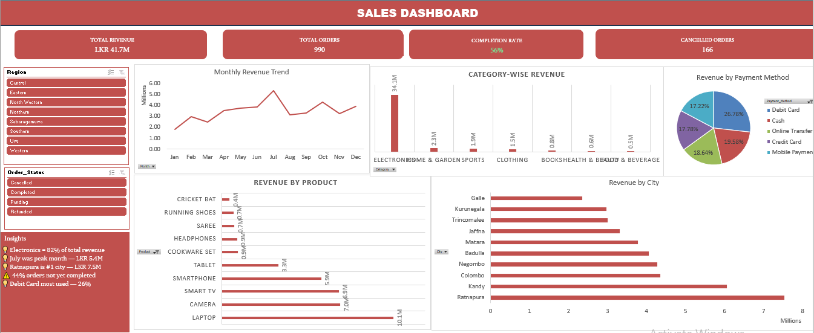
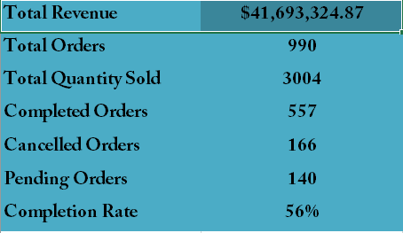
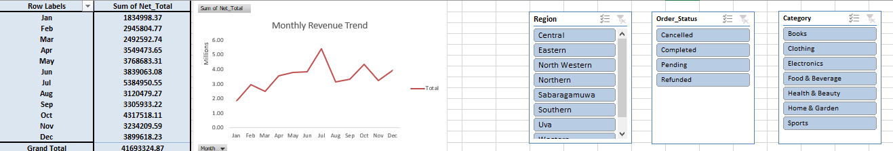

# Sri Lanka Sales Dashboard (Excel Project)

## Project Overview

This project is an interactive Excel sales dashboard created using a Sri Lankan retail sales dataset.

The dashboard helps analyze:

* Revenue trends
* Product performance
* Regional sales
* Payment methods
* Order status
* KPI metrics

---

## Tools Used

* Microsoft Excel
* Pivot Tables
* Pivot Charts
* Slicers
* Data Cleaning
* KPI Cards

---

## Features

* Interactive slicers
* Monthly revenue trend analysis
* Category-wise revenue analysis
* City-wise sales comparison
* Payment method insights
* Dynamic KPI tracking

---

## KPIs Included

* Total Revenue
* Total Orders
* Completion Rate
* Cancelled Orders

## Dashboard Preview

### Main Dashboard

### KPI Section

### Charts Section

## Insights

* Electronics generated the highest revenue
* Ratnapura was the top-performing city
* July recorded the highest sales
* Debit cards were the most used payment method

---

## Author

Mohammed Majith
